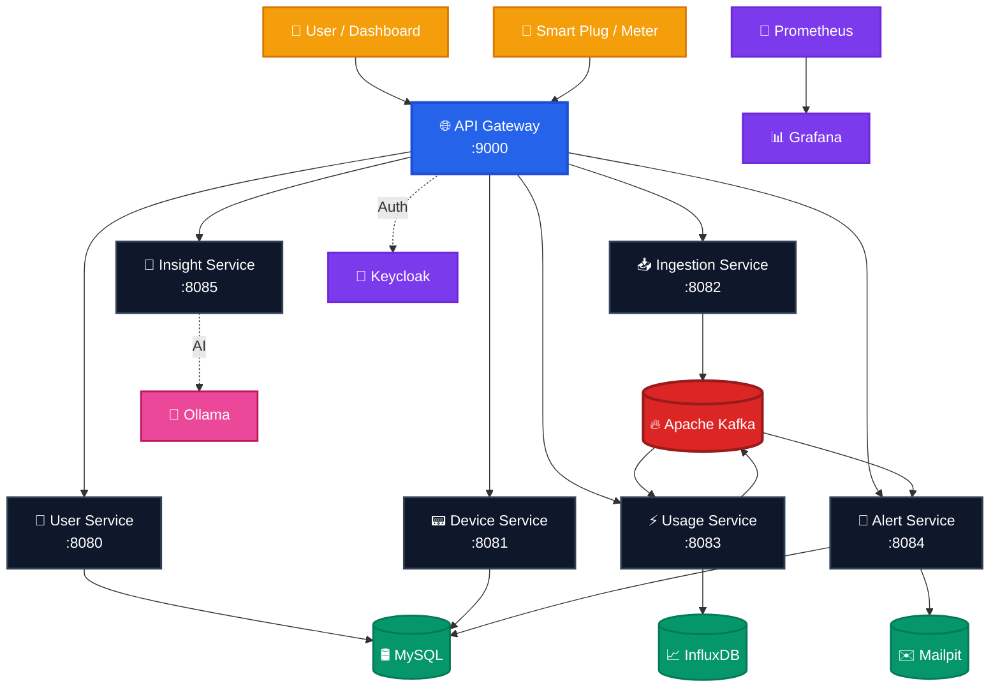

# GridPulse

<div align="center">

**GridPulse** is a production-style **home energy tracking platform** built with a microservices architecture to collect power usage events, aggregate consumption metrics, trigger alerts, and expose observability-ready APIs for real-time and historical energy insights.

[]()
[]()
[]()
[]()
[]()
[]()
[]()
[]()
[]()
[]()
[]()
[]()
[]()
[]()

</div>

---

## Overview

GridPulse models how a real-world home energy management product ingests power readings from smart plugs or meters, processes high-volume device events reliably, stores relational and time-series data separately, and notifies residents when usage crosses predefined thresholds.

The system is designed around a practical backend architecture:

- **HTTP APIs** for users, devices, usage, alerts, and insights
- **Kafka-based event streaming** for decoupled ingestion and processing
- **MySQL** for durable domain and transactional data
- **InfluxDB** for time-series energy measurements
- **JWT-secured API Gateway** for centralized access control
- **Observability stack** with Prometheus and Grafana
- **Local development tooling** with Keycloak and Mailpit
- **Spring AI-powered insights** for energy usage summaries and recommendations

---

## Problem Statement

Raw energy telemetry from smart plugs and meters is noisy, high-volume, and continuous. A production-grade system must handle:

- Reliable ingestion without blocking client requests
- Decoupled processing for scalability
- Separate storage strategies for metadata and measurements
- Threshold-based alerting
- Auditability and operational visibility
- Resilient public APIs behind a single secure entry point

GridPulse demonstrates that split architecture in a clean, practical form.

---

## Core Use Cases

- Track per-device energy usage over time
- Aggregate consumption for billing-style views
- Alert when instantaneous or total usage exceeds a limit
- Secure all public HTTP traffic through a gateway with JWT validation
- Inspect service health, latency, errors, and circuit-breaker state
- Generate AI-assisted energy insights and usage summaries

---

## Architecture



---

## Technology Stack

| Layer | Technology |
|---|---|
| Language | Java 21 |
| Framework | Spring Boot 4 for domain services and gateway |
| AI Service | Spring Boot 3.5 + Spring AI |
| Cloud Stack | Spring Cloud 2025.1.0 |
| Gateway | Spring Cloud Gateway (Server WebMVC) |
| Resilience | Resilience4j Circuit Breaker |
| Messaging | Apache Kafka (KRaft) |
| Relational DB | MySQL 8 |
| Time-Series DB | InfluxDB 2 |
| Identity | Keycloak |
| Email | Mailpit |
| Observability | Micrometer, Prometheus, Grafana |
| API Docs | springdoc-openapi |
| Containerization | Docker, Docker Compose |
| Build Tool | Maven with `mvnw` per service |

---

## Services

<table>
<tr>
<td width="50%">

### 🌐 API Gateway
> **Port:** `9000`

Acts as the single public entry point for all incoming HTTP traffic and centralizes request routing across internal services.

**Responsibilities**
- Request routing and aggregation  
- JWT validation using OAuth2 Resource Server  
- Circuit breakers with Resilience4j  
- Aggregated OpenAPI documentation

**Technologies**
`Spring Boot 4` `Spring Cloud Gateway` `Resilience4j` `OAuth2 Resource Server`

</td>

<td width="50%">

### 📟 Device Service
> **Port:** `8081`

Responsible for managing smart devices connected to the platform, including registration, ownership mapping, metadata storage, and lifecycle status management.

**Responsibilities**
- Device registration  
- Metadata & ownership management  
- Device lifecycle tracking  
- Configuration APIs

**Technologies**
`Spring Boot 4` `JPA` `MySQL` `Flyway`

</td>
</tr>

<tr>
<td width="50%">

### ⚡ Usage Service
> **Port:** `8083`

Processes incoming energy consumption readings from the streaming pipeline and performs aggregation, threshold analysis, and time-series persistence.

**Responsibilities**
- Consume Kafka energy events  
- Usage aggregation  
- Threshold evaluation  
- Store metrics in InfluxDB

**Technologies**
`Spring Boot 4` `Kafka` `InfluxDB` `Micrometer`

</td>

<td width="50%">

### 🚨 Alert Service
> **Port:** `8084`

Monitors processed consumption events and evaluates predefined thresholds or abnormal usage patterns.

**Responsibilities**
- Threshold monitoring  
- Alert generation  
- Notification orchestration  
- Alert persistence

**Technologies**
`Spring Boot 4` `Kafka` `JPA` `Mail` `MySQL`

</td>
</tr>

<tr>
<td width="50%">

### 🧠 Insight Service
> **Port:** `8085`

Provides intelligent energy usage insights using Spring AI and optional Ollama integration.

**Responsibilities**
- Energy consumption summaries  
- AI-powered recommendations  
- Usage anomaly explanations  
- Natural language insights

**Technologies**
`Spring AI` `Ollama` `Spring Boot`

</td>

<td width="50%">

### 📨 Notification Service
> **Internal Service**

Handles outbound communication workflows such as alerts, warnings, and energy notifications.

**Responsibilities**
- Email notifications  
- Alert communication  
- Mailpit integration (local)  
- Extensible notification design

**Technologies**
`Spring Mail` `Kafka` `Mailpit`

</td>
</tr>

<tr>
<td width="50%">

### 🔐 Keycloak Integration
> **Authentication Layer**

Provides authentication and identity management using JWT-based security.

**Responsibilities**
- Identity management  
- OAuth2 authentication  
- Role-based authorization  
- JWT token validation

**Technologies**
`Keycloak` `OAuth2` `JWT`

</td>

<td width="50%">

### 📊 Observability Stack
> **Monitoring Layer**

Implements production-style monitoring and diagnostics for operational visibility.

**Responsibilities**
- Metrics collection  
- JVM & health monitoring  
- Dashboard visualization  
- Performance observability

**Technologies**
`Spring Actuator` `Micrometer` `Prometheus` `Grafana`

</td>
</tr>
</table>

---

## Key Features

- Secure JWT-based authentication
- Centralized API Gateway routing
- Event-driven processing with Kafka
- Separate storage for transactional and time-series workloads
- Threshold-based alerting pipeline
- AI-generated energy insights
- OpenAPI aggregation at the gateway
- Circuit breaker protection with Resilience4j
- Metrics and dashboards for runtime visibility
- Dockerized local development environment
- Maven wrapper support for consistent builds

---

## Data Flow

1. A smart device or simulated meter sends a power reading.
2. The request enters through the API Gateway.
3. The relevant service validates and persists domain data.
4. The reading is published to Kafka.
5. The Usage Service aggregates and stores measurements in InfluxDB.
6. The Alert Service evaluates thresholds.
7. Notification workflows are triggered when needed.
8. Prometheus scrapes metrics and Grafana visualizes system health.

---

## Local Development

### Prerequisites
- Java 21
- Docker and Docker Compose
- Maven (or use the included `mvnw` scripts)

### Run with Docker Compose
```bash
docker compose up -d
```

### Run a service locally
```bash
cd <service-name>
./mvnw spring-boot:run
```

### Access points
- API Gateway: `http://localhost:<gateway-port>`
- Keycloak: `http://localhost:<keycloak-port>`
- Grafana: `http://localhost:<grafana-port>`
- Prometheus: `http://localhost:<prometheus-port>`
- Kafka UI: `http://localhost:<kafka-ui-port>`
- Mailpit: `http://localhost:<mailpit-port>`

---

## Configuration Notes

Typical environment configuration includes:

- Kafka bootstrap servers
- MySQL datasource credentials
- InfluxDB token, bucket, and organization
- Keycloak issuer and client configuration
- SMTP settings for Mailpit
- Prometheus scrape endpoints
- OpenAPI route metadata at the gateway

---

## Observability

GridPulse is built to be observable from day one.

### Metrics
Collected through Micrometer and exported to Prometheus.

### Dashboards
Grafana dashboards can be used to inspect:
- Request latency
- Error rates
- Consumer lag
- Circuit-breaker state
- Service throughput
- Usage ingestion trends

### Logs
Structured logs make tracing event flow and debugging service interactions easier.

---

## Security

- Public traffic is routed through the API Gateway
- JWT validation is enforced at the gateway layer
- Keycloak is used for local authentication and authorization
- Internal services can remain isolated from direct public access

---

## Engineering Highlights

- Event-driven microservices architecture
- Time-series optimized measurement storage
- Relational persistence for durable domain data
- Gateway-based security and routing
- Resilience patterns for downstream failures
- Operational visibility through metrics and dashboards
- Spring AI extension point for smart recommendations

---

## Suggested Repository Structure

```txt
gridpulse/
├── alert-service/
├── api-gateway/
├── device-service/
├── infra/
├── insight-service/
├── notification-service/
├── usage-service/
├── user-service/
├── docker-compose.yml
└── README.md
```

---

🧑‍💻 Author

Ayush Gupta
💼 GitHub: https://github.com/Brew-and-Bugs-with-Ayush

🌐 LinkedIn: https://www.linkedin.com/in/ayush-gupta004

📧 Email: ayushgupta.Codex@gmail.com

📝 License

This project is licensed under the MIT License — feel free to use, learn, and build upon it.

---

🌟 Support

If you find this project helpful, please ⭐ star the repository — it helps others discover it and motivates continued development!

“Code. Build. Flow. — That’s GridPulse.” 🚀
