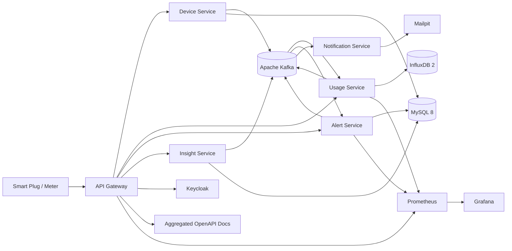

# GridPulse

<div align="center">

**GridPulse** is a production-style **home energy tracking platform** built with a microservices architecture to collect power usage events, aggregate consumption metrics, trigger alerts, and expose observability-ready APIs for real-time and historical energy insights.

[]()
[]()
[]()
[]()
[]()
[]()

</div>

---

## Overview

GridPulse models how a real-world home energy management product ingests power readings from smart plugs or meters, processes high-volume device events reliably, stores relational and time-series data separately, and notifies residents when usage crosses predefined thresholds.

The system is designed around a practical backend architecture:

- **HTTP APIs** for users, devices, usage, alerts, and insights
- **Kafka-based event streaming** for decoupled ingestion and processing
- **MySQL** for durable domain and transactional data
- **InfluxDB** for time-series energy measurements
- **JWT-secured API Gateway** for centralized access control
- **Observability stack** with Prometheus and Grafana
- **Local development tooling** with Keycloak and Mailpit
- **Spring AI-powered insights** for energy usage summaries and recommendations

---

## Problem Statement

Raw energy telemetry from smart plugs and meters is noisy, high-volume, and continuous. A production-grade system must handle:

- Reliable ingestion without blocking client requests
- Decoupled processing for scalability
- Separate storage strategies for metadata and measurements
- Threshold-based alerting
- Auditability and operational visibility
- Resilient public APIs behind a single secure entry point

GridPulse demonstrates that split architecture in a clean, practical form.

---

## Core Use Cases

- Track per-device energy usage over time
- Aggregate consumption for billing-style views
- Alert when instantaneous or total usage exceeds a limit
- Secure all public HTTP traffic through a gateway with JWT validation
- Inspect service health, latency, errors, and circuit-breaker state
- Generate AI-assisted energy insights and usage summaries

---

## Architecture



---

## Technology Stack

| Layer | Technology |
|---|---|
| Language | Java 21 |
| Framework | Spring Boot 4 for domain services and gateway |
| AI Service | Spring Boot 3.5 + Spring AI |
| Cloud Stack | Spring Cloud 2025.1.0 |
| Gateway | Spring Cloud Gateway (Server WebMVC) |
| Resilience | Resilience4j Circuit Breaker |
| Messaging | Apache Kafka (KRaft) |
| Relational DB | MySQL 8 |
| Time-Series DB | InfluxDB 2 |
| Identity | Keycloak |
| Email | Mailpit |
| Observability | Micrometer, Prometheus, Grafana |
| API Docs | springdoc-openapi |
| Containerization | Docker, Docker Compose |
| Build Tool | Maven with `mvnw` per service |

---

## Services

> Replace these names with the exact services in your repository if they differ.

### API Gateway
Single public entry point for all HTTP traffic. Handles routing, JWT validation, and OpenAPI aggregation.

### Device Service
Manages device registration, metadata, ownership, and device status.

### Usage Service
Consumes power readings, aggregates usage, and persists time-series measurements to InfluxDB.

### Alert Service
Evaluates thresholds and triggers alert workflows when consumption exceeds configured limits.

### Insight Service
Uses Spring AI to generate summaries, recommendations, or energy efficiency insights.

### Notification Service
Sends notifications such as email alerts through local Mailpit in development.

### Keycloak Integration
Provides local identity and access management with JWT-based authentication.

### Observability Stack
Exposes metrics through Micrometer, Prometheus, and Grafana dashboards.

---

## Key Features

- Secure JWT-based authentication
- Centralized API Gateway routing
- Event-driven processing with Kafka
- Separate storage for transactional and time-series workloads
- Threshold-based alerting pipeline
- AI-generated energy insights
- OpenAPI aggregation at the gateway
- Circuit breaker protection with Resilience4j
- Metrics and dashboards for runtime visibility
- Dockerized local development environment
- Maven wrapper support for consistent builds

---

## Data Flow

1. A smart device or simulated meter sends a power reading.
2. The request enters through the API Gateway.
3. The relevant service validates and persists domain data.
4. The reading is published to Kafka.
5. The Usage Service aggregates and stores measurements in InfluxDB.
6. The Alert Service evaluates thresholds.
7. Notification workflows are triggered when needed.
8. Prometheus scrapes metrics and Grafana visualizes system health.

---

## API Highlights

> Update these endpoints to match your implementation.

```http
POST   /api/devices
GET    /api/devices/{deviceId}
POST   /api/energy/readings
GET    /api/usage/{deviceId}
POST   /api/alerts/config
GET    /api/insights/{deviceId}
```

---

## Local Development

### Prerequisites
- Java 21
- Docker and Docker Compose
- Maven (or use the included `mvnw` scripts)

### Run with Docker Compose
```bash
docker compose up -d
```

### Run a service locally
```bash
cd <service-name>
./mvnw spring-boot:run
```

### Access points
- API Gateway: `http://localhost:<gateway-port>`
- Keycloak: `http://localhost:<keycloak-port>`
- Grafana: `http://localhost:<grafana-port>`
- Prometheus: `http://localhost:<prometheus-port>`
- Kafka UI: `http://localhost:<kafka-ui-port>`
- Mailpit: `http://localhost:<mailpit-port>`

---

## Configuration Notes

Typical environment configuration includes:

- Kafka bootstrap servers
- MySQL datasource credentials
- InfluxDB token, bucket, and organization
- Keycloak issuer and client configuration
- SMTP settings for Mailpit
- Prometheus scrape endpoints
- OpenAPI route metadata at the gateway

---

## Observability

GridPulse is built to be observable from day one.

### Metrics
Collected through Micrometer and exported to Prometheus.

### Dashboards
Grafana dashboards can be used to inspect:
- Request latency
- Error rates
- Consumer lag
- Circuit-breaker state
- Service throughput
- Usage ingestion trends

### Logs
Structured logs make tracing event flow and debugging service interactions easier.

---

## Security

- Public traffic is routed through the API Gateway
- JWT validation is enforced at the gateway layer
- Keycloak is used for local authentication and authorization
- Internal services can remain isolated from direct public access

---

## Engineering Highlights

- Event-driven microservices architecture
- Time-series optimized measurement storage
- Relational persistence for durable domain data
- Gateway-based security and routing
- Resilience patterns for downstream failures
- Operational visibility through metrics and dashboards
- Spring AI extension point for smart recommendations

---

## Suggested Repository Structure

```txt
gridpulse/
├── api-gateway/
├── device-service/
├── usage-service/
├── alert-service/
├── insight-service/
├── notification-service/
├── docker/
├── docs/
├── docker-compose.yml
└── README.md
```

---

## Future Enhancements

- Real-time WebSocket dashboard updates
- Multi-tenant household support
- Advanced forecasting and anomaly detection
- Cost estimation by tariff plan
- Exportable monthly billing reports
- Distributed tracing with OpenTelemetry
- Dead-letter queue handling for Kafka failures
- Rate limiting and request quota controls

---

## Screenshots

Add screenshots here to increase credibility and GitHub discoverability.

- Gateway Swagger UI
- Grafana dashboards
- Kafka UI topics
- Keycloak login screen
- Energy usage charts
- Alert notification sample

---

## Why This Project Stands Out

GridPulse is not a basic CRUD backend. It demonstrates architecture decisions that map to production systems:

- stream processing over synchronous coupling
- specialized storage per workload
- secure gateway-centric access
- resilience and observability by default
- practical energy-domain modeling
- extensibility for AI-driven insights

This makes it suitable for backend, distributed systems, and platform engineering portfolios.

---

## License

Add your preferred license here.

---

## Contact

Add your GitHub profile, LinkedIn, or portfolio link here.
